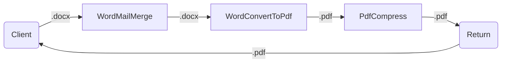
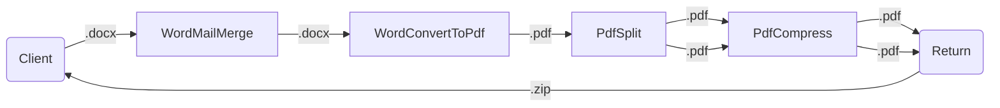
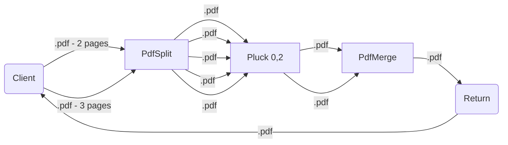

# Compose API

One endpoint that accepts one or more documents and a list of [`Actions`](#actions) to apply to those documents. 

## Usage

`POST` **/v1/compose**

The endpoint accepts a `multipart/form-data` request body with a `file` part that contains the document(s) to process and an `actions` part that contains a JSON string with the actions to run.

```js
POST /v1/compose
Content-Type: multipart/form-data; boundary=----BOUNDRYNAME

------BOUNDRYNAME
Content-Disposition: form-data; name="file"; filename="/path/to/document.pdf"
Content-Type: application/pdf

(data)
------BOUNDRYNAME
Content-Disposition: form-data; name="actions"

[
    {"kind": "PdfSplit"}
]
------BOUNDRYNAME--
```

> This request would split a PDF document into multiple documents, one per page. 

#### Multipart Form Data

##### `file` **(required)**

Add a `file` part **for each** document to include in the request. Be sure to add a valid `Content-Type`.

##### `actions` **(required)**

Add one `actions` part. Its contents should be an array of actions (`Action[]`) serialized to a JSON string.

## Actions

Actions are a way to express a transformation of a document. Each action has a `kind` property that
identifies its type, and zero or more other property options that are specific to that action. Actions are executed sequentially. When an action runs, it takes the output from the previous step as input. It applies its transformation to the document(s) and its output is then used for the next action.


```js
[
  {
    "kind": "WordMailMerge",
    "data": {
      "FirstName": "John",
      "LastName": "Doe"
    }
  },
  {
    "kind": "WordConvertToPdf"
  },
  {
    "kind": "PdfCompress"
  }
]
```

**Explanation** This request contains 3 actions:

1. First the Word document is mail merged using the provided data. `kind` = [`WordMailMerge`](/compose/word/MailMergeWordAction.md)
2. The next action converts the Word document to a PDF. `kind` = [`WordConvertToPdf`](/compose/word/ConvertToPdfWordAction.md)
3. Finally, the PDF is compressed to reduce its size. `kind`= [`PdfCompress`](/compose/pdf/CompressPdfAction.md)

The 

### Diagrams

**Example 1**

A word document is mail merged, then converted to a PDF, then compressed and finally returned.



**Example 2**

A word document is mail merged, then converted to a PDF, then split into multiple documents. Each document is then compressed and then they are returned to the client as a zip file.



**Example 3**

2 PDF documents are passed, the first has 2 pages and the second has 3. Each is split, resulting in 5 separate PDF documents. We then select, using `Pluck`, the items we want to keep, index 0 and 2; the first page of each of the original documents. Finally, we merge the 2 documents into a new PDF and return.



### Common Properties

These properties are common to all actions.

```js
{
    "kind": "...",
    "continueOnError": false
}
```

#### Details

**`kind`** `ActionKind` **Required**

A discriminator that identifies the type of action.

**`continueOnError`** `boolean`

If true and an error happens in the action, the error is ignored and processing continues with the next action.