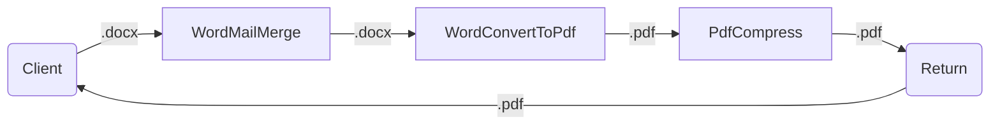
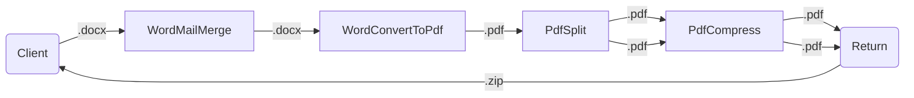
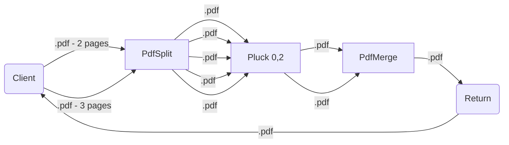

# Examples

### Example 1

A word document is mail merged, then converted to a PDF, then compressed and finally returned.



#### Request

```js
[
    {
        "kind": "WordMailMerge",
        "data": {
            "FirstName": "John",
            "LastName": "Doe"
        }
    },
    { "kind": "WordConvertToPdf" },
    { "kind": "PdfCompress" }
]
```

### Example 2

A word document is mail merged, then converted to a PDF, then split into multiple documents. Each document is then compressed and then they are returned to the client as a zip file.



#### Request

```js
[
    {
        "kind": "WordMailMerge",
        "data": {
            "FirstName": "John",
            "LastName": "Doe"
        }
    },
    { "kind": "WordConvertToPdf" },
    { "kind": "PdfSplit" },
    { "kind": "PdfCompress" }
]
```

### Example 3

2 PDF documents are passed, the first has 2 pages and the second has 3. Each is split, resulting in 5 separate PDF documents. Then we use [`Pluck`](/compose/common/PluckAction.md) to select the items we want to keep: index 0 and 2 (the first page of each of the original documents). Finally, we merge the 2 documents into a new PDF and return.



#### Request

```js
[
    { "kind": "PdfSplit" },
    {
        "kind": "Pluck",
        "indexes": [0, 2]
    },
    { "kind": "PdfMerge" }
]
```